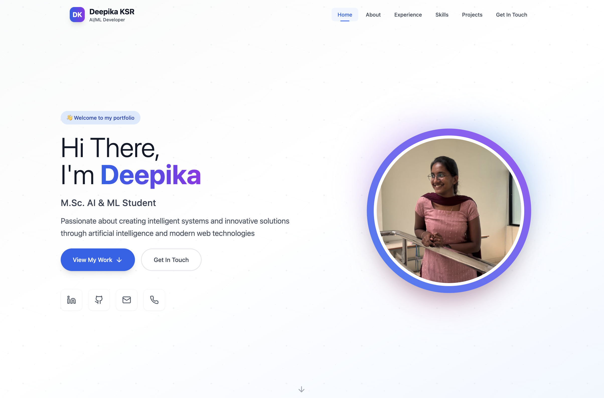
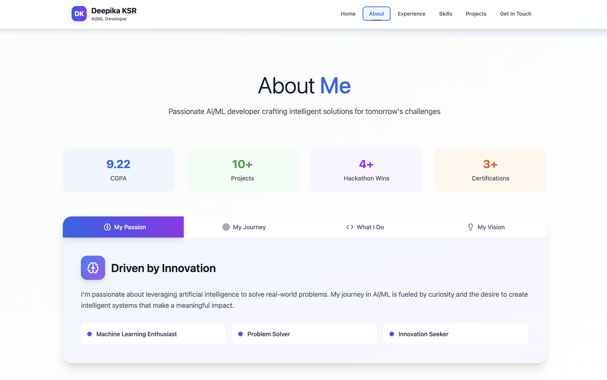
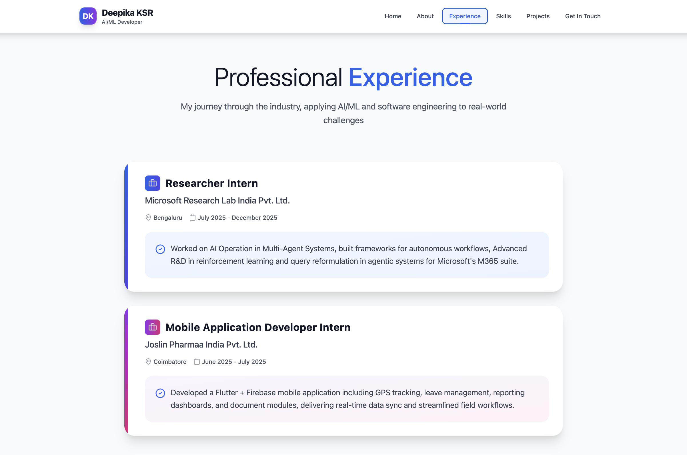
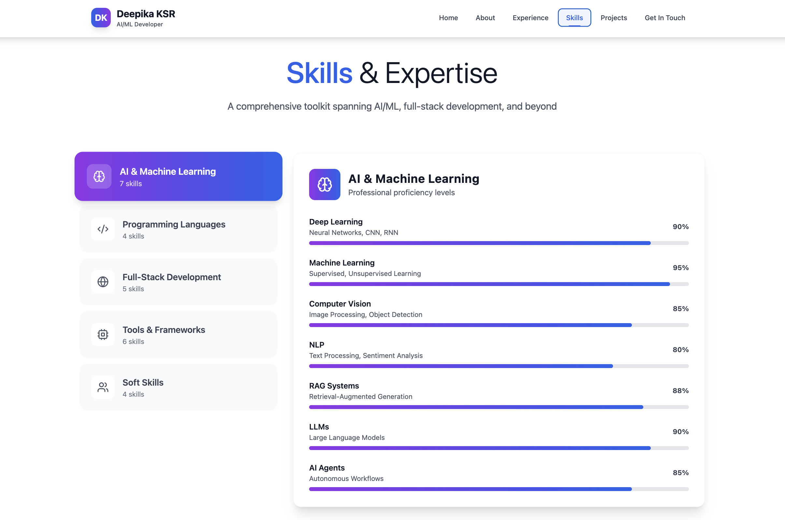
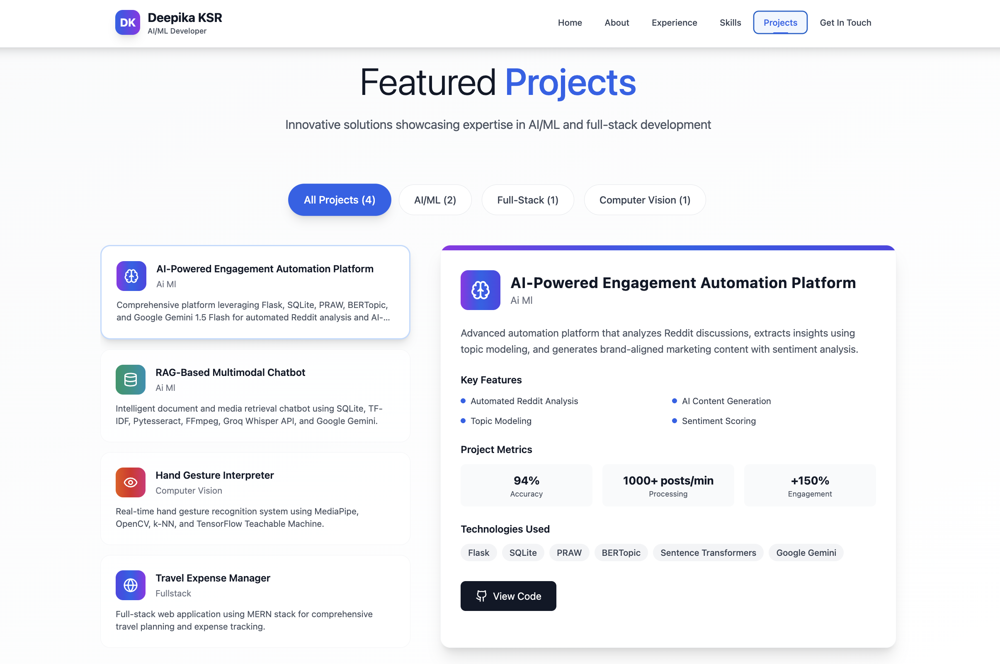
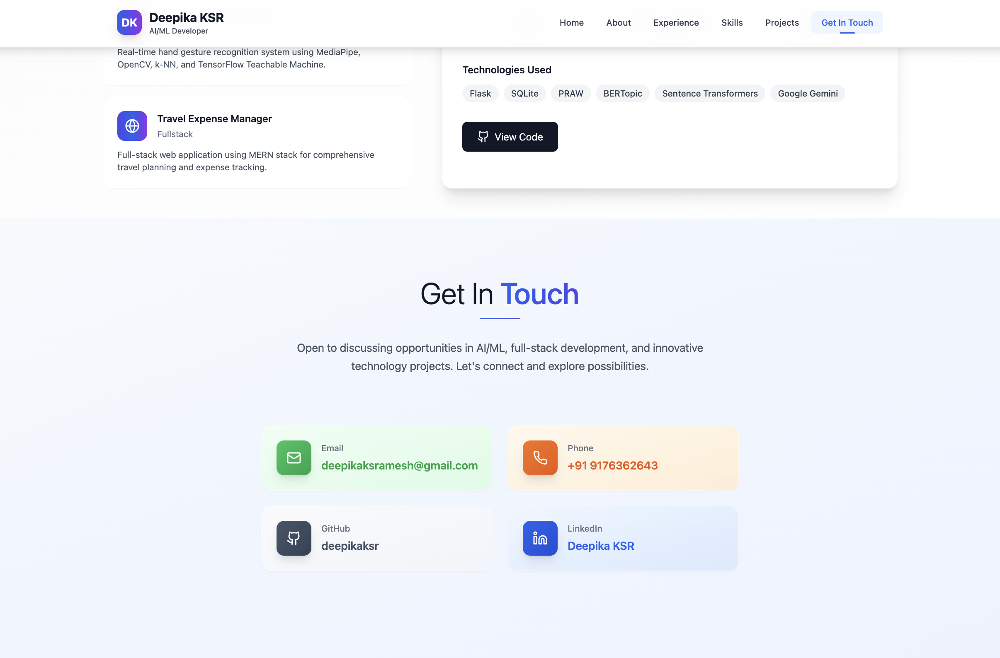

# 💼 Deepika KSR — Portfolio

A modern, responsive personal portfolio website showcasing my AI/ML and Full-Stack Development journey.

🔗 **Live Site:** [https://deepikaksr.github.io/deepika-ksr-portfolio/](https://deepikaksr.github.io/deepika-ksr-portfolio/)

---

## 📸 Project Preview

<p align="center">
  
  <br>
  <i>Home Section</i>
</p>

<p align="center">
  
  <br>
  <i>About Section</i>
</p>

<p align="center">
  
  <br>
  <i>Experience Section</i>
</p>

<p align="center">
  
  <br>
  <i>Skills Section</i>
</p>

<p align="center">
  
  <br>
  <i>Projects Section</i>
</p>

<p align="center">
  
  <br>
  <i>Contact Section</i>
</p>

---

## 💡 Sections

| Section | Description |
|---|---|
| **Hero** | Introduction and social links |
| **About Me** | Passion, background, and vision |
| **Professional Experience** | Internship and industry experience |
| **Skills** | Technical proficiency and tools |
| **Featured Projects** | Showcasing AI/ML and Web projects |
| **Contact** | Communication channels |

---

## 🛠️ Tech Stack

| Category | Technologies |
|---|---|
| **Framework** | React 18 + TypeScript |
| **Build Tool** | Vite |
| **Styling** | Tailwind CSS |
| **UI Components** | shadcn/ui |
| **Deployment** | GitHub Pages |

---

## 📂 Project Structure

```
deepika-ksr-portfolio/
├── public/                     # Media assets and static files
├── src/
│   ├── components/             # React components
│   │   └── ui/                 # UI component library
│   ├── pages/                  # Page layouts
│   ├── App.tsx                 # Routing
│   └── main.tsx                # Entry point
├── tailwind.config.ts          # Styling configuration
└── vite.config.ts              # Build configuration
```

---

## ⚙️ Getting Started

```bash
# Clone and install
git clone https://github.com/deepikaksr/deepika-ksr-portfolio.git
cd deepika-ksr-portfolio
npm install

# Run locally
npm run dev
```

---

## 🚀 Deployment

```bash
# Build and deploy to GitHub Pages
npm run deploy
```

---

## 📬 Contact

- **LinkedIn:** [deepika-ksr](https://www.linkedin.com/in/deepika-ksr-9a3330254)
- **GitHub:** [deepikaksr](https://github.com/deepikaksr)
- **Email:** deepikaksramesh@gmail.com

---

## 📄 License

This project is open source and available for personal use.
